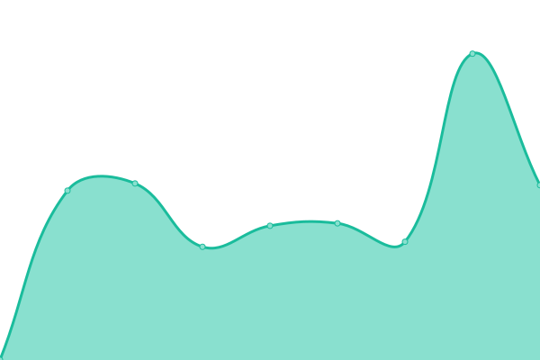
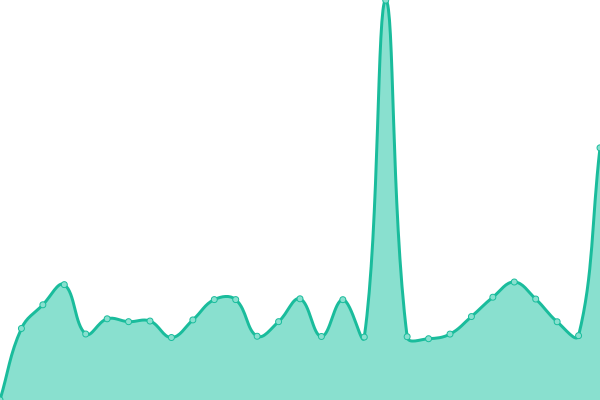
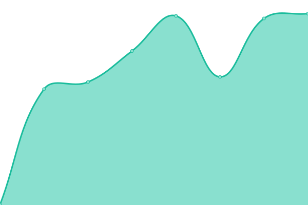

# [📈 Live Status](https://uptime.pwr.omikor.in): <!--live status--> **🟧 Partial outage**

This repository contains the open-source uptime monitor and status page for [Michał Korczak](https://omikor.in), powered by [Upptime](https://github.com/upptime/upptime).

With [Upptime](https://upptime.js.org), you can get your own unlimited and free uptime monitor and status page, powered entirely by a GitHub repository. We use [Issues](https://github.com/Omikorin/pwr-uptime/issues) as incident reports, [Actions](https://github.com/Omikorin/pwr-uptime/actions) as uptime monitors, and [Pages](https://uptime.pwr.omikor.in) for the status page.

<!--start: status pages-->
<!-- This summary is generated by Upptime (https://github.com/upptime/upptime) -->
<!-- Do not edit this manually, your changes will be overwritten -->
<!-- prettier-ignore -->
| URL | Status | History | Response Time | Uptime |
| --- | ------ | ------- | ------------- | ------ |
|  [Akademicki Inkubator Przedsibiorczoci](https://inkubator.pwr.edu.pl) |  Up | [akademicki-inkubator-przedsiebiorczosci.yml](https://github.com/Omikorin/pwr-uptime/commits/HEAD/history/akademicki-inkubator-przedsiebiorczosci.yml) | 

 1376ms
     
 | 

<a href="https://uptime.pwr.omikor.in/history/akademicki-inkubator-przedsiebiorczosci">100.00%</a>
    

|  [Biblioteka](https://biblioteka.pwr.edu.pl) |  Up | [biblioteka.yml](https://github.com/Omikorin/pwr-uptime/commits/HEAD/history/biblioteka.yml) | 

 1271ms
     
 | 

<a href="https://uptime.pwr.omikor.in/history/biblioteka">100.00%</a>
    

|  [Biuletyn Informacji Publicznej](https://bip.pwr.edu.pl) |  Up | [biuletyn-informacji-publicznej.yml](https://github.com/Omikorin/pwr-uptime/commits/HEAD/history/biuletyn-informacji-publicznej.yml) | 

 1453ms
     
 | 

<a href="https://uptime.pwr.omikor.in/history/biuletyn-informacji-publicznej">100.00%</a>
    

|  [Biuro Karier](https://biurokarier.pwr.edu.pl) |  Up | [biuro-karier.yml](https://github.com/Omikorin/pwr-uptime/commits/HEAD/history/biuro-karier.yml) | 

 6726ms
     
 | 

<a href="https://uptime.pwr.omikor.in/history/biuro-karier">100.00%</a>
    

|  [Centrum Doskonaoci Dydaktycznej](https://cdd.pwr.edu.pl) |  Down | [centrum-doskonalosci-dydaktycznej.yml](https://github.com/Omikorin/pwr-uptime/commits/HEAD/history/centrum-doskonalosci-dydaktycznej.yml) | 

 813ms
     
 | 

<a href="https://uptime.pwr.omikor.in/history/centrum-doskonalosci-dydaktycznej">16.69%</a>
    

|  [Centrum Innowacji i Biznesu](https://biznes.pwr.edu.pl) |  Up | [centrum-innowacji-i-biznesu.yml](https://github.com/Omikorin/pwr-uptime/commits/HEAD/history/centrum-innowacji-i-biznesu.yml) | 

 1513ms
     
 | 

<a href="https://uptime.pwr.omikor.in/history/centrum-innowacji-i-biznesu">100.00%</a>
    

|  [Doktoranci](https://doktoranci.pwr.edu.pl) |  Up | [doktoranci.yml](https://github.com/Omikorin/pwr-uptime/commits/HEAD/history/doktoranci.yml) | 

 1269ms
     
 | 

<a href="https://uptime.pwr.omikor.in/history/doktoranci">100.00%</a>
    

|  [Dzia Dostpnoci i Wsparcia Os贸b z Niepenosprawnociami](https://ddo.pwr.edu.pl) |  Down | [dzial-dostepnosci-i-wsparcia-osob-z-niepelnosprawnosciami.yml](https://github.com/Omikorin/pwr-uptime/commits/HEAD/history/dzial-dostepnosci-i-wsparcia-osob-z-niepelnosprawnosciami.yml) | 

 894ms
     
 | 

<a href="https://uptime.pwr.omikor.in/history/dzial-dostepnosci-i-wsparcia-osob-z-niepelnosprawnosciami">100.00%</a>
    

|  [Dzia Informatyzacji](https://di.pwr.edu.pl) |  Down | [dzial-informatyzacji.yml](https://github.com/Omikorin/pwr-uptime/commits/HEAD/history/dzial-informatyzacji.yml) | 

 783ms
     
 | 

<a href="https://uptime.pwr.omikor.in/history/dzial-informatyzacji">10.80%</a>
    

|  [Dzia Ksztacenia Podyplomowego i E-learningu](https://cku.pwr.edu.pl) |  Up | [dzial-ksztalcenia-podyplomowego-i-e-learningu.yml](https://github.com/Omikorin/pwr-uptime/commits/HEAD/history/dzial-ksztalcenia-podyplomowego-i-e-learningu.yml) | 

 796ms
     
 | 

<a href="https://uptime.pwr.omikor.in/history/dzial-ksztalcenia-podyplomowego-i-e-learningu">83.89%</a>
    

|  [Dzia Nauki](https://nauka.pwr.edu.pl) |  Down | [dzial-nauki.yml](https://github.com/Omikorin/pwr-uptime/commits/HEAD/history/dzial-nauki.yml) | 

 826ms
     
 | 

<a href="https://uptime.pwr.omikor.in/history/dzial-nauki">43.98%</a>
    

|  [Dzia Projekt贸w](https://dp.pwr.edu.pl) |  Down | [dzial-projektow.yml](https://github.com/Omikorin/pwr-uptime/commits/HEAD/history/dzial-projektow.yml) | 

 879ms
     
 | 

<a href="https://uptime.pwr.omikor.in/history/dzial-projektow">10.02%</a>
    

|  [Dzia Studencki](https://dzialstudencki.pwr.edu.pl) |  Down | [dzial-studencki.yml](https://github.com/Omikorin/pwr-uptime/commits/HEAD/history/dzial-studencki.yml) | 

 1446ms
     
 | 

<a href="https://uptime.pwr.omikor.in/history/dzial-studencki">49.32%</a>
    

|  [Dzia Zakup贸w i Zam贸wie Publicznych](https://przetargi.pwr.edu.pl) |  Up | [dzial-zakupow-i-zamowien-publicznych.yml](https://github.com/Omikorin/pwr-uptime/commits/HEAD/history/dzial-zakupow-i-zamowien-publicznych.yml) | 

 760ms
     
 | 

<a href="https://uptime.pwr.omikor.in/history/dzial-zakupow-i-zamowien-publicznych">83.88%</a>
    

|  [Edukacja.CL](https://edukacja.pwr.wroc.pl) |  Up | [edukacja-cl.yml](https://github.com/Omikorin/pwr-uptime/commits/HEAD/history/edukacja-cl.yml) | 

 748ms
     
 | 

<a href="https://uptime.pwr.omikor.in/history/edukacja-cl">100.00%</a>
    

|  [Elektroniczna Karta Pracownicza](https://ekp.pwr.edu.pl) |  Down | [elektroniczna-karta-pracownicza.yml](https://github.com/Omikorin/pwr-uptime/commits/HEAD/history/elektroniczna-karta-pracownicza.yml) | 

 0ms
     
 | 

<a href="https://uptime.pwr.omikor.in/history/elektroniczna-karta-pracownicza">0.02%</a>
    

|  [Elektroniczna Ksi偶ka Telefoniczna](https://ekt.pwr.edu.pl) |  Down | [elektroniczna-ksiazka-telefoniczna.yml](https://github.com/Omikorin/pwr-uptime/commits/HEAD/history/elektroniczna-ksiazka-telefoniczna.yml) | 

 0ms
     
 | 

<a href="https://uptime.pwr.omikor.in/history/elektroniczna-ksiazka-telefoniczna">0.02%</a>
    

|  [Elektroniczny Monitoring Um贸w](https://emu.pwr.edu.pl) |  Down | [elektroniczny-monitoring-umow.yml](https://github.com/Omikorin/pwr-uptime/commits/HEAD/history/elektroniczny-monitoring-umow.yml) | 

 0ms
     
 | 

<a href="https://uptime.pwr.omikor.in/history/elektroniczny-monitoring-umow">0.02%</a>
    

|  [ePortal](https://eportal.pwr.edu.pl) |  Up | [e-portal.yml](https://github.com/Omikorin/pwr-uptime/commits/HEAD/history/e-portal.yml) | 

 1440ms
     
 | 

<a href="https://uptime.pwr.omikor.in/history/e-portal">100.00%</a>
    

|  [Intranet](https://intranet.pwr.edu.pl) |  Down | [intranet.yml](https://github.com/Omikorin/pwr-uptime/commits/HEAD/history/intranet.yml) | 

 0ms
     
 | 

<a href="https://uptime.pwr.omikor.in/history/intranet">0.02%</a>
    

|  [JSOS](https://jsos.pwr.edu.pl) |  Up | [jsos.yml](https://github.com/Omikorin/pwr-uptime/commits/HEAD/history/jsos.yml) | 

 1704ms
     
 | 

<a href="https://uptime.pwr.omikor.in/history/jsos">100.00%</a>
    

|  [Oferty Pracy](https://ofertypracy.pwr.edu.pl) |  Up | [oferty-pracy.yml](https://github.com/Omikorin/pwr-uptime/commits/HEAD/history/oferty-pracy.yml) | 

 569ms
     
 | 

<a href="https://uptime.pwr.omikor.in/history/oferty-pracy">100.00%</a>
    

|  [Pion Prorektora ds. Ksztacenia](https://prk.pwr.edu.pl) |  Up | [pion-prorektora-ds-ksztalcenia.yml](https://github.com/Omikorin/pwr-uptime/commits/HEAD/history/pion-prorektora-ds-ksztalcenia.yml) | 

 2236ms
     
 | 

<a href="https://uptime.pwr.omikor.in/history/pion-prorektora-ds-ksztalcenia">55.75%</a>
    

|  [Pion Prorektora ds. Studenckich](https://prs.pwr.edu.pl) |  Up | [pion-prorektora-ds-studenckich.yml](https://github.com/Omikorin/pwr-uptime/commits/HEAD/history/pion-prorektora-ds-studenckich.yml) | 

 2543ms
     
 | 

<a href="https://uptime.pwr.omikor.in/history/pion-prorektora-ds-studenckich">100.00%</a>
    

|  [Poczta Pracownicza (przestarzaa)](https://e.pwr.edu.pl/) |  Up | [poczta-pracownicza-przestarzala.yml](https://github.com/Omikorin/pwr-uptime/commits/HEAD/history/poczta-pracownicza-przestarzala.yml) | 

 714ms
     
 | 

<a href="https://uptime.pwr.omikor.in/history/poczta-pracownicza-przestarzala">100.00%</a>
    

|  [Poczta Pracownicza (przestarzaa, nie dziaa)](https://pmail.pwr.edu.pl) |  Up | [poczta-pracownicza-przestarzala-nie-dziala.yml](https://github.com/Omikorin/pwr-uptime/commits/HEAD/history/poczta-pracownicza-przestarzala-nie-dziala.yml) | 

 928ms
     
 | 

<a href="https://uptime.pwr.omikor.in/history/poczta-pracownicza-przestarzala-nie-dziala">100.00%</a>
    

|  [Poczta Studencka (przestarzaa, nie dziaa)](https://s.student.pwr.edu.pl) |  Up | [poczta-studencka-przestarzala-nie-dziala.yml](https://github.com/Omikorin/pwr-uptime/commits/HEAD/history/poczta-studencka-przestarzala-nie-dziala.yml) | 

 691ms
     
 | 

<a href="https://uptime.pwr.omikor.in/history/poczta-studencka-przestarzala-nie-dziala">100.00%</a>
    

|  [Poczta WCSS](https://poczta.wcss.pl) |  Up | [poczta-wcss.yml](https://github.com/Omikorin/pwr-uptime/commits/HEAD/history/poczta-wcss.yml) | 

 976ms
     
 | 

<a href="https://uptime.pwr.omikor.in/history/poczta-wcss">100.00%</a>
    

|  [Politechnika Wrocawska](https://pwr.edu.pl) |  Up | [politechnika-wroclawska.yml](https://github.com/Omikorin/pwr-uptime/commits/HEAD/history/politechnika-wroclawska.yml) | 

 1152ms
     
 | 

<a href="https://uptime.pwr.omikor.in/history/politechnika-wroclawska">99.31%</a>
    

|  [Poradnia Psychologiczna](https://ppp.pwr.edu.pl) |  Up | [poradnia-psychologiczna.yml](https://github.com/Omikorin/pwr-uptime/commits/HEAD/history/poradnia-psychologiczna.yml) | 

 566ms
     
 | 

<a href="https://uptime.pwr.omikor.in/history/poradnia-psychologiczna">100.00%</a>
    

|  [Rada Doktorant贸w](https://radadoktorantow.pwr.edu.pl) |  Down | [rada-doktorantow.yml](https://github.com/Omikorin/pwr-uptime/commits/HEAD/history/rada-doktorantow.yml) | 

 0ms
     
 | 

<a href="https://uptime.pwr.omikor.in/history/rada-doktorantow">0.00%</a>
    

|  [Rada Jakoci Ksztacenia](https://rjk.pwr.edu.pl) |  Up | [rada-jakosci-ksztalcenia.yml](https://github.com/Omikorin/pwr-uptime/commits/HEAD/history/rada-jakosci-ksztalcenia.yml) | 

 906ms
     
 | 

<a href="https://uptime.pwr.omikor.in/history/rada-jakosci-ksztalcenia">82.86%</a>
    

|  [Rekrutacja](https://rekrutacja.pwr.edu.pl) |  Up | [rekrutacja.yml](https://github.com/Omikorin/pwr-uptime/commits/HEAD/history/rekrutacja.yml) | 

 1889ms
     
 | 

<a href="https://uptime.pwr.omikor.in/history/rekrutacja">100.00%</a>
    

|  [Samorzd Studencki](https://samorzad.pwr.edu.pl) |  Up | [samorzad-studencki.yml](https://github.com/Omikorin/pwr-uptime/commits/HEAD/history/samorzad-studencki.yml) | 

 1367ms
     
 | 

<a href="https://uptime.pwr.omikor.in/history/samorzad-studencki">84.23%</a>
    

|  [Studium Jzyk贸w Obcych](https://sjo.pwr.edu.pl) |  Up | [studium-jezykow-obcych.yml](https://github.com/Omikorin/pwr-uptime/commits/HEAD/history/studium-jezykow-obcych.yml) | 

 1392ms
     
 | 

<a href="https://uptime.pwr.omikor.in/history/studium-jezykow-obcych">88.26%</a>
    

|  [Studium Wychowania Fizycznego i Sportu](https://swfis.pwr.edu.pl) |  Up | [studium-wychowania-fizycznego-i-sportu.yml](https://github.com/Omikorin/pwr-uptime/commits/HEAD/history/studium-wychowania-fizycznego-i-sportu.yml) | 

 1011ms
     
 | 

<a href="https://uptime.pwr.omikor.in/history/studium-wychowania-fizycznego-i-sportu">95.92%</a>
    

|  [Szkoa Doktorska](https://szd.pwr.edu.pl) |  Up | [szkola-doktorska.yml](https://github.com/Omikorin/pwr-uptime/commits/HEAD/history/szkola-doktorska.yml) | 

 950ms
     
 | 

<a href="https://uptime.pwr.omikor.in/history/szkola-doktorska">80.92%</a>
    

|  [USOS](https://web.usos.pwr.edu.pl) |  Up | [usos.yml](https://github.com/Omikorin/pwr-uptime/commits/HEAD/history/usos.yml) | 

 806ms
     
 | 

<a href="https://uptime.pwr.omikor.in/history/usos">98.53%</a>
    

|  [Wydzia Architektury](https://wa.pwr.edu.pl) |  Up | [wydzial-architektury.yml](https://github.com/Omikorin/pwr-uptime/commits/HEAD/history/wydzial-architektury.yml) | 

 1272ms
     
 | 

<a href="https://uptime.pwr.omikor.in/history/wydzial-architektury">63.20%</a>
    

|  [Wydzia Budownictwa Ldowego i Wodnego](https://wbliw.pwr.edu.pl) |  Down | [wydzial-budownictwa-ladowego-i-wodnego.yml](https://github.com/Omikorin/pwr-uptime/commits/HEAD/history/wydzial-budownictwa-ladowego-i-wodnego.yml) | 

 1982ms
     
 | 

<a href="https://uptime.pwr.omikor.in/history/wydzial-budownictwa-ladowego-i-wodnego">55.26%</a>
    

|  [Wydzia Chemiczny](https://wch.pwr.edu.pl) |  Down | [wydzial-chemiczny.yml](https://github.com/Omikorin/pwr-uptime/commits/HEAD/history/wydzial-chemiczny.yml) | 

 1038ms
     
 | 

<a href="https://uptime.pwr.omikor.in/history/wydzial-chemiczny">48.09%</a>
    

|  [Wydzia Informatyki i Telekomunikacji](https://wit.pwr.edu.pl) |  Up | [wydzial-informatyki-i-telekomunikacji.yml](https://github.com/Omikorin/pwr-uptime/commits/HEAD/history/wydzial-informatyki-i-telekomunikacji.yml) | 

 940ms
     
 | 

<a href="https://uptime.pwr.omikor.in/history/wydzial-informatyki-i-telekomunikacji">64.68%</a>
    

|  [Wydzia Geoin偶ynierii, G贸rnictwa i Geologii](https://wggg.pwr.edu.pl) |  Down | [wydzial-geoinzynierii-gornictwa-i-geologii.yml](https://github.com/Omikorin/pwr-uptime/commits/HEAD/history/wydzial-geoinzynierii-gornictwa-i-geologii.yml) | 

 1741ms
     
 | 

<a href="https://uptime.pwr.omikor.in/history/wydzial-geoinzynierii-gornictwa-i-geologii">51.02%</a>
    

|  [Wydzia In偶ynierii rodowiska](https://wis.pwr.edu.pl) |  Down | [wydzial-inzynierii-srodowiska.yml](https://github.com/Omikorin/pwr-uptime/commits/HEAD/history/wydzial-inzynierii-srodowiska.yml) | 

 1058ms
     
 | 

<a href="https://uptime.pwr.omikor.in/history/wydzial-inzynierii-srodowiska">46.15%</a>
    

|  [Wydzia Zarzdzania](https://wz.pwr.edu.pl) |  Up | [wydzial-zarzadzania.yml](https://github.com/Omikorin/pwr-uptime/commits/HEAD/history/wydzial-zarzadzania.yml) | 

 912ms
     
 | 

<a href="https://uptime.pwr.omikor.in/history/wydzial-zarzadzania">85.81%</a>
    

|  [Wydzia Mechaniczno-Energetyczny](https://wme.pwr.edu.pl) |  Down | [wydzial-mechaniczno-energetyczny.yml](https://github.com/Omikorin/pwr-uptime/commits/HEAD/history/wydzial-mechaniczno-energetyczny.yml) | 

 1812ms
     
 | 

<a href="https://uptime.pwr.omikor.in/history/wydzial-mechaniczno-energetyczny">49.81%</a>
    

|  [Wydzia Mechaniczny](https://wm.pwr.edu.pl) |  Down | [wydzial-mechaniczny.yml](https://github.com/Omikorin/pwr-uptime/commits/HEAD/history/wydzial-mechaniczny.yml) | 

 1249ms
     
 | 

<a href="https://uptime.pwr.omikor.in/history/wydzial-mechaniczny">50.57%</a>
    

|  [Wydzia Podstawowych Problem贸w Techniki](https://wppt.pwr.edu.pl) |  Down | [wydzial-podstawowych-problemow-techniki.yml](https://github.com/Omikorin/pwr-uptime/commits/HEAD/history/wydzial-podstawowych-problemow-techniki.yml) | 

 1485ms
     
 | 

<a href="https://uptime.pwr.omikor.in/history/wydzial-podstawowych-problemow-techniki">44.88%</a>
    

|  [Wydzia Elektroniki, Fotoniki i Mikrosystem贸w](https://wefim.pwr.edu.pl) |  Up | [wydzial-elektroniki-fotoniki-i-mikrosystemow.yml](https://github.com/Omikorin/pwr-uptime/commits/HEAD/history/wydzial-elektroniki-fotoniki-i-mikrosystemow.yml) | 

 1460ms
     
 | 

<a href="https://uptime.pwr.omikor.in/history/wydzial-elektroniki-fotoniki-i-mikrosystemow">68.41%</a>
    

|  [Wydzia Matematyki](https://wmat.pwr.edu.pl) |  Up | [wydzial-matematyki.yml](https://github.com/Omikorin/pwr-uptime/commits/HEAD/history/wydzial-matematyki.yml) | 

 1791ms
     
 | 

<a href="https://uptime.pwr.omikor.in/history/wydzial-matematyki">40.64%</a>
    

|  [Zintegrowany System Kontroli Dostpu i Bezpieczestwa Fizycznego](https://skd.pwr.edu.pl) |  Up | [zintegrowany-system-kontroli-dostepu-i-bezpieczenstwa-fizycznego.yml](https://github.com/Omikorin/pwr-uptime/commits/HEAD/history/zintegrowany-system-kontroli-dostepu-i-bezpieczenstwa-fizycznego.yml) | 

 2157ms
     
 | 

<a href="https://uptime.pwr.omikor.in/history/zintegrowany-system-kontroli-dostepu-i-bezpieczenstwa-fizycznego">100.00%</a>
    

<!--end: status pages-->

[**Visit our status website →**](https://uptime.pwr.omikor.in)

## 📄 License

- Powered by: [Upptime](https://github.com/upptime/upptime)
- Code: [MIT](./LICENSE) © [Michał Korczak](https://omikor.in)
- Data in the `./history` directory: [Open Database License](https://opendatacommons.org/licenses/odbl/1-0/)
